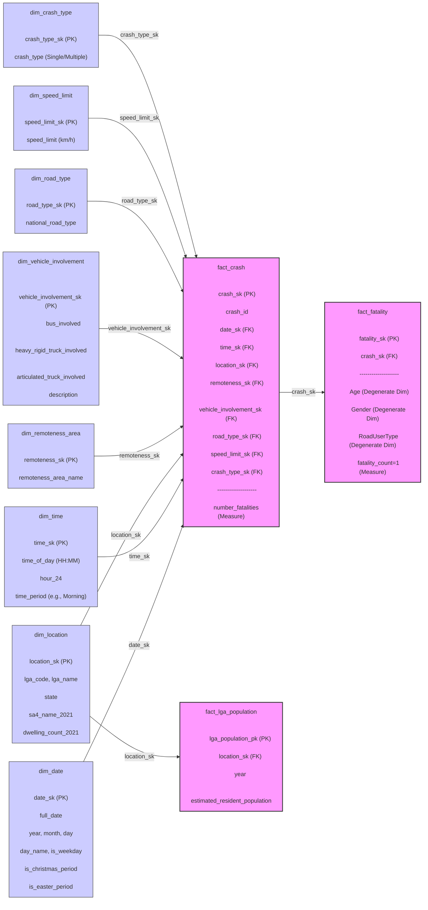

**final report in `__Report Analysing Australian Road Fatal Crash with a Data Warehouse__.pdf`**

**Select and Acquire Datasets**:

- Use the “Fatal Crashes – December 2024” and “Fatalities – December 2024” datasets. Also use “Dwelling Count Data” or “Population Data,” or introduce other relevant sources.

**Requirements Analysis**:

- Define the goal of the data warehouse: to help government and public stakeholders understand the importance of road safety and reduce traffic risks.
- Clarify the business questions the warehouse must answer, for example:
  - What factors most commonly lead to fatal crashes?
  - How do fatal crash counts trend in specific regions?
  - What is the proportion of different road users (e.g., drivers, pedestrians) in fatal crashes?

**Conceptual Schema Design**:

- Draw a Star Schema diagram to identify the data warehouse’s fact and dimension tables citeturn1search2.
- Identify at least eight dimensions, such as time, location, crash type, vehicle type, road conditions, weather conditions, driver age, and gender.
- Define the hierarchy and attributes of each dimension.

**Logical Schema Design**:

- Convert the conceptual model into a logical model, choosing a star or snowflake schema.
- Specify the fields for the fact table and each dimension table, and define their relationships.
- Ensure every table has a primary key, and that the fact table’s foreign keys reference the corresponding dimension table primary keys.

**Physical Schema Design**:

- Select a suitable DBMS (e.g., PostgreSQL).
- Create the actual tables in the DBMS based on your logical design.
- Plan performance optimizations such as indexing and partitioning.

**Data Cleaning and Loading**:

- Clean the raw data: handle missing values, duplicates, and outliers.
- Transform the cleaned data to fit the warehouse schema.
- Use ETL tools or write scripts to extract, transform, and load the data into the warehouse.

**Multidimensional Data Analysis and Visualization**:

- Use SQL queries or OLAP tools for multidimensional analysis to answer your business questions.
- Build dashboards and reports in Power BI or Tableau to present key insights.
- Include map visualizations to show geographic distribution and regional differences.

**Association Rule Mining**:

- Write Python code using an algorithm like Apriori or FP‑Growth for association rule mining.
- Analyze and interpret the top k rules involving “Road User,” ranked by lift and confidence.
- Explain these rules in clear, accessible language.
- Propose at least three actionable recommendations for government policy based on your findings.

**Report**:

- Compile the project report, including:
  - Background and objectives
  - Data description and preprocessing steps
  - Data warehouse design (with Star Schema diagram and database architecture)
  - Multidimensional analysis results and visualizations
  - Association rule mining methods, results, and recommendations
- Ensure the report is clear, well‑structured, and meets submission guidelines.

```
python3 -m venv venv
source venv/bin/activate
pip install openpyxl

```

- Initial dw design 


