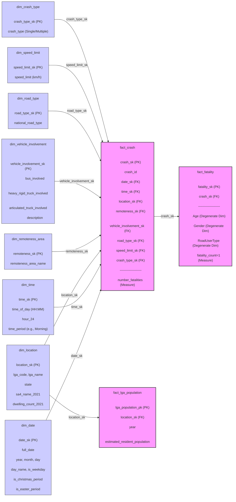

**选择并获取数据集**：

- 使用 "Fatal Crashes - December 2024" 和 "Fatalities - December 2024" 数据集。还需使用 "Dwelling Count Data" 或 "Population Data"，或引入其他相关数据源。
- 下载并熟悉所选数据集的内容和结构。

**需求分析**：

- 确定数据仓库的目标，即帮助政府和公众了解道路安全的重要性，降低交通风险。
- 明确数据仓库需要回答的业务问题，例如：
  - 哪些因素最常导致致命车祸？
  - 特定地区的致命车祸数量趋势如何？
  - 不同道路使用者（如司机、行人）在致命车祸中的比例是多少？

**概念结构设计**：

- 绘制 StarNet 图，确定数据仓库的维度和事实表。
- 识别至少 8 个维度，例如时间、地点、事故类型、车辆类型、道路条件、天气状况、驾驶员年龄和性别等。
- 定义每个维度的层次结构和属性。

**逻辑结构设计**：

- 将概念模型转换为逻辑模型，设计星型或雪花模式的数据库架构。
- 确定事实表和维度表的字段，以及它们之间的关系。
- 确保每个表都有主键，事实表中的外键引用相应的维度表主键。

**物理结构设计**：

- 选择合适的数据库管理系统（DBMS），如 PostgreSQL。
- 根据逻辑模型，在 DBMS 中创建实际的数据库表。
- 考虑索引、分区等性能优化策略。

**数据清洗与加载**：

- 对原始数据进行清洗，处理缺失值、重复值和异常值。
- 将清洗后的数据转换为符合数据仓库架构的格式。
- 使用 ETL（抽取、转换、加载）工具或编写脚本，将数据加载到数据仓库中。

**多维数据分析与可视化**：

- 使用 SQL 查询或 OLAP 工具，对数据仓库进行多维度分析，回答之前定义的业务问题。
- 使用 Power BI、Tableau 等可视化工具，创建仪表板和报告，展示关键见解。
- 确保包含地图可视化，以展示地理分布和区域差异。

**关联规则挖掘**：

- 使用 Python 编写代码，选择适当的算法（如 Apriori、FP-Growth）对数据进行关联规则挖掘。
- 分析并解释右侧包含 "Road User" 的前 k 条规则（按提升度和置信度排序）。
- 用通俗易懂的语言解释这些规则的含义。
- 根据挖掘结果，提出至少三条建议，供政府参考以改善道路安全。

**撰写报告并提交**：

- 整理并编写项目报告，包括以下内容：
  - 项目背景和目标。
  - 数据描述和预处理过程。
  - 数据仓库设计（包含 StarNet 图和数据库架构）。
  - 多维数据分析结果和可视化展示。
  - 关联规则挖掘的方法、结果和建议。
- 确保报告内容清晰、结构合理，并符合提交要求。
- 在截止日期（4 月 11 日晚上 11:59）前，通过 LMS 提交报告和相关文件。

```
python3 -m venv venv
source venv/bin/activate
pip install openpyxl

```

### Potential Business Needs and Questions (Based on Data Warehouse Structure)

#### 1. Spatio-Temporal Analysis of Traffic Crashes

- **Analysis Question**: Are there significant differences in crash frequency (number of crashes) and severity (e.g., average fatalities per crash, fatality rate) across different times (e.g., month, day of week, day/night) and different locations (e.g., state, LGA, road type, remoteness area)?
- **Core Data / Relevant Tables**:
  - `fact_crash` (for `COUNT(crash_sk)` and `SUM(number_fatalities)`)
  - `dim_date` (joined via `date_sk` for `year`, `month`, `day_name`, `is_weekday`)
  - `dim_time` (joined via `time_sk` for `time_period`)
  - `dim_location` (joined via `location_sk` for `state`, `lga_name`, `sa4_name_2021`)
  - `dim_road_type` (joined via `road_type_sk` for `national_road_type`)
  - `dim_remoteness_area` (joined via `remoteness_sk` for `remoteness_area_name`)
- **Dimensions**: `dim_date`, `dim_time`, `dim_location`, `dim_road_type`, `dim_remoteness_area`.
- **Analysis Goal**: Identify peak times and high-risk location/road feature combinations for crashes to inform targeted interventions and resource allocation by authorities.

#### 2. Safety Analysis of Different Road Types and Vehicle Involvements

- **Analysis Question**: What are the associations between specific road types (e.g., Arterial Road, Local Road) or crash types (Single/Multiple vehicle) and the involvement of specific vehicle types (e.g., bus, heavy rigid truck, articulated truck) in terms of crash frequency and fatalities?
- **Core Data / Relevant Tables**:
  - `fact_crash` (for crash counts and fatalities)
  - `dim_vehicle_involvement` (joined via `vehicle_involvement_sk` for `bus_involved`, `heavy_rigid_truck_involved`, `articulated_truck_involved`, `description`)
  - `dim_road_type` (joined via `road_type_sk` for `national_road_type`)
  - `dim_crash_type` (joined via `crash_type_sk` for `crash_type`)
- **Dimensions**: `dim_vehicle_involvement`, `dim_road_type`, `dim_crash_type`.
- **Analysis Goal**: Evaluate the risks associated with different vehicle types on various road types and in different crash scenarios to support data-driven road safety design and regulations.

#### 3. Crash Analysis in Relation to Population and Dwelling Density

- **Analysis Question**: Is there a correlation between the crash rate (e.g., crashes per 100,000 residents) or fatality rate (e.g., fatalities per 100,000 residents) in specific Local Government Areas (LGAs) and the area's population size or dwelling count (from 2021, as a proxy for density)?
- **Core Data / Relevant Tables**:
  - `fact_crash` (aggregate `COUNT(crash_sk)` and `SUM(number_fatalities)` by year and location)
  - `dim_location` (joined via `location_sk` for `lga_name`, `dwelling_count_2021`)
  - `dim_date` (joined via `date_sk` for `year`)
  - `fact_lga_population` (joined via `location_sk` and `year` for `estimated_resident_population`)
- **Dimensions / Context**: `dim_location`, `dim_date`, `fact_lga_population` (provides the population base for rate calculation).
- **Analysis Goal**: Understand the relationship between population distribution and crash risk, compare standardized crash/fatality rates across LGAs, and inform resource allocation for traffic management.

#### 4. Relationship Between Holidays and Crash Occurrence

- **Analysis Question**: Is the crash frequency or the number/severity of fatal crashes significantly higher during holiday periods (Christmas, Easter) compared to other times of the year?
- **Core Data / Relevant Tables**:
  - `fact_crash` (for crash counts and fatalities)
  - `dim_date` (joined via `date_sk` for `is_christmas_period`, `is_easter_period`, `full_date`)
- **Dimensions**: `dim_date` (utilizing the holiday flag attributes).
- **Analysis Goal**: Quantify the impact of holiday periods on traffic crash trends and implement targeted prevention measures during these high-risk times.

#### 5. Analysis of Crash Types and Road Conditions

- **Analysis Question**: Is there an association between different crash types (Single vs. Multiple vehicle) and road environment characteristics such as speed limits or the remoteness category of the area?
- **Core Data / Relevant Tables**:
  - `fact_crash` (for crash counts and fatalities)
  - `dim_crash_type` (joined via `crash_type_sk` for `crash_type`)
  - `dim_speed_limit` (joined via `speed_limit_sk` for `speed_limit`)
  - `dim_remoteness_area` (joined via `remoteness_sk` for `remoteness_area_name`)
- **Dimensions**: `dim_crash_type`, `dim_speed_limit`, `dim_remoteness_area`.
- **Analysis Goal**: Evaluate relationships between crash typology and road conditions to help tailor traffic management strategies for specific environments.

#### 6. Analysis of Seasonal Crash Patterns (Based on Available Data)

- **Analysis Question**: Are there discernible seasonal patterns (e.g., analyzing by month or quarter) in crash frequency or severity?
- **Core Data / Relevant Tables**:
  - `fact_crash` (for crash counts and fatalities)
  - `dim_date` (joined via `date_sk` for `month`, `year`)
- **Dimensions**: `dim_date` (using month and year attributes for aggregation).
- **Analysis Goal**: Identify seasonal peaks or troughs in crash occurrence to aid seasonal preparedness for traffic authorities. (Note: Analysis of direct weather impact requires external data integration).

#### 7. Regional Traffic Crash Risk Assessment

- **Analysis Question**: Which Local Government Areas (LGAs) or Statistical Areas Level 4 (SA4s) have the highest crash fatality rates (fatalities per 100,000 residents)? Do these high-risk regions share common characteristics related to road types, remoteness, etc.?
- **Core Data / Relevant Tables**:
  - `fact_crash` (aggregate `SUM(number_fatalities)` by year and location)
  - `dim_location` (joined via `location_sk` for `lga_name`, `sa4_name_2021`)
  - `dim_date` (joined via `date_sk` for `year`)
  - `fact_lga_population` (joined via `location_sk` and `year` for `estimated_resident_population`)
  - (Optional) Other dimension tables (`dim_road_type`, `dim_remoteness_area`, etc.) to profile high-risk areas.
- **Dimensions / Context**: `dim_location`, `dim_date`, `fact_lga_population`.
- **Analysis Goal**: Assess and compare crash risk across different administrative regions using standardized rates, identify priority areas for intervention, and explore potential contributing factors.

#### 8. Analysis of Fatal Crash Victim Characteristics (New)

- **Analysis Question**: What are the demographic profiles (Age, Gender, Road User Type) of individuals involved in fatal crashes? Do these profiles vary significantly by location (LGA, remoteness area) or time (year, time period)?
- **Core Data / Relevant Tables**:
  - `fact_fatality` (provides `Age`, `Gender`, `RoadUserType`, `fatality_count`)
  - `fact_crash` (links `fact_fatality` via `crash_sk` to dimensions)
  - `dim_date`, `dim_time`, `dim_location`, `dim_remoteness_area`, etc. (provide context via `fact_crash` join)
- **Dimensions / Context**: Degenerate dimensions in `fact_fatality`, plus linked dimensions (`dim_date`, `dim_time`, `dim_location`, etc.) via `fact_crash`.
- **Analysis Goal**: Understand the characteristics of those most vulnerable in fatal crashes to develop more targeted road safety education campaigns and prevention strategies (e.g., focusing on elderly pedestrians or young motorcyclists in specific regions).

---

### Core Data and Data Table Roles (Summary)

- **Fact Tables**:
  - `fact_crash`: Contains the primary measure (`number_fatalities`) and foreign keys to all dimension tables. It's the starting point for most analyses, calculating crash frequency and total fatalities. Granularity: Per crash event.
  - `fact_fatality`: Contains details of each fatality (`Age`, `Gender`, `RoadUserType` as degenerate dimensions) and a measure (`fatality_count=1`). Linked back to `fact_crash` via `crash_sk`. Used for analyzing victim characteristics. Granularity: Per fatality.
  - `fact_lga_population`: Stores estimated resident population (`estimated_resident_population`) by year and LGA. Linked via `location_sk` and `year` (from `dim_date`) primarily for calculating rates (e.g., crash rate, fatality rate).
- **Dimension Tables (8 total)**:
  - `dim_date`, `dim_time`: Provide the temporal context (year, month, day, time period, holiday flags).
  - `dim_location`: Provides geographic context (State, LGA, SA4, 2021 dwelling count).
  - `dim_remoteness_area`: Categorizes the location by remoteness.
  - `dim_vehicle_involvement`: Describes specific vehicle types involved.
  - `dim_road_type`: Specifies the type of road where the crash occurred.
  - `dim_speed_limit`: Indicates the speed limit at the crash location.
  - `dim_crash_type`: Classifies the crash (Single/Multiple vehicle).
  - These tables contain descriptive attributes used to slice, dice, and filter the fact data, enabling analysis from various perspectives.


