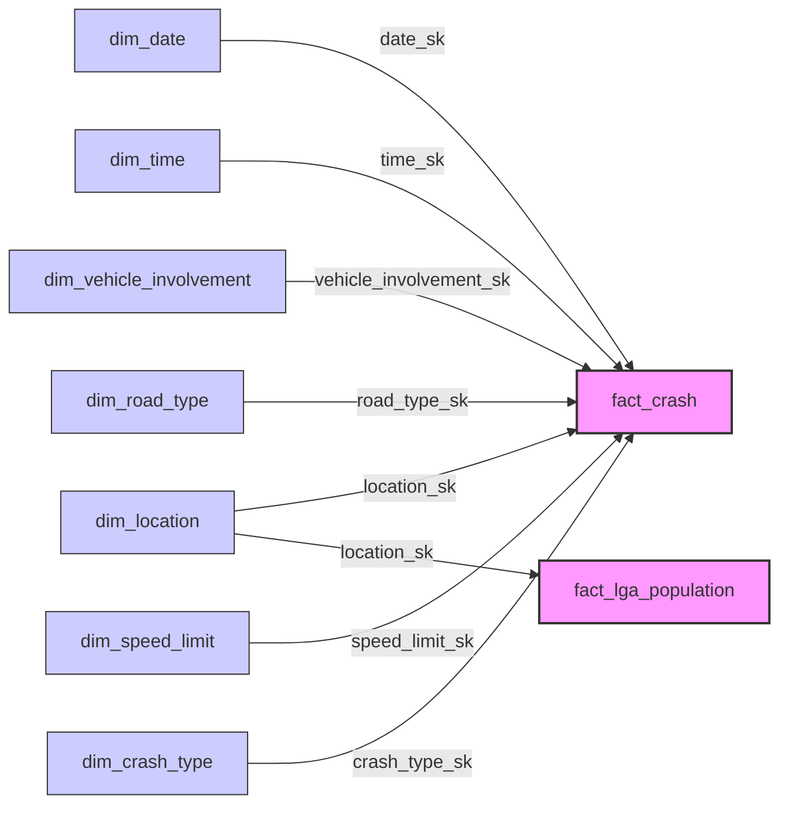

### **1. 事实表（Fact Table）：`fatal_crashes_fact`**

这个表包含事故的核心统计数据：

| 字段名           | 数据类型 | 说明              |
| ---------------- | -------- | ----------------- |
| crash_id         | INT (PK) | 事故唯一标识      |
| date_id          | INT (FK) | 关联日期维度      |
| location_id      | INT (FK) | 关联事故地点维    |
| vehicle_id       | INT (FK) | 关联车辆类型维度  |
| road_type_id     | INT (FK) | 关联道路类型维度  |
| total_fatalities | INT      | 死亡人数          |
| speed_limit      | INT      | 事故路段限速      |
| holiday_id       | INT (FK) | 关联节假日维度    |
| time_of_day      | VARCHAR  | 白天/晚上         |
| day_of_week      | VARCHAR  | 工作日/周末       |
| crash_type       | VARCHAR  | 单车事故/多车事故 |
|                  |          |                   |

------

### **2. 维度表（Dimension Tables）**

#### **（1）日期维度：`date_dim`**

| 字段名      | 数据类型 | 说明         |
| ----------- | -------- | ------------ |
| date_id     | INT (PK) | 日期唯一标识 |
| year        | INT      | 年份         |
| month       | INT      | 月份         |
| day_of_week | VARCHAR  | 星期几       |

------

#### **（2）地点维度：`location_dim`**

| 字段名              | 数据类型 | 说明                                                         |
| ------------------- | -------- | ------------------------------------------------------------ |
| location_id         | INT (PK) | 地点唯一标识                                                 |
| state               | VARCHAR  | 州（NSW, TAS等）                                             |
| national_remoteness | VARCHAR  | 偏远程度（Inner Regional Australia, Outer Regional Australia） |
| SA4_name            | VARCHAR  | SA4 统计区域名称                                             |
| national_LGA_name   | VARCHAR  | LGA 名称                                                     |

------

#### **（3）车辆维度：`vehicle_dim`**

| 字段名            | 数据类型 | 说明                 |
| ----------------- | -------- | -------------------- |
| vehicle_id        | INT (PK) | 车辆唯一标识         |
| bus_involvement   | BOOLEAN  | 是否有公交车         |
| heavy_rigid_truck | BOOLEAN  | 是否涉及重型刚性卡车 |
| articulated_truck | BOOLEAN  | 是否涉及铰接式卡车   |

------

#### **（4）道路类型维度：`road_type_dim`**

| 字段名             | 数据类型 | 说明                                                         |
| ------------------ | -------- | ------------------------------------------------------------ |
| road_type_id       | INT (PK) | 道路类型唯一标识                                             |
| national_road_type | VARCHAR  | 道路类型（Arterial Road, Local Road, National or State Highway） |

------

#### **（5）节假日维度：`holiday_dim`**

| 字段名           | 数据类型 | 说明             |
| ---------------- | -------- | ---------------- |
| holiday_id       | INT (PK) | 节假日唯一标识   |
| christmas_period | BOOLEAN  | 是否在圣诞节期间 |
| easter_period    | BOOLEAN  | 是否在复活节期间 |

------

### **3. 关系建模（Star Schema）**

你的数据仓库模型是一个 **星型模式（Star Schema）**，中心是 `fatal_crashes_fact` 事实表，其他维度表围绕它建立。

